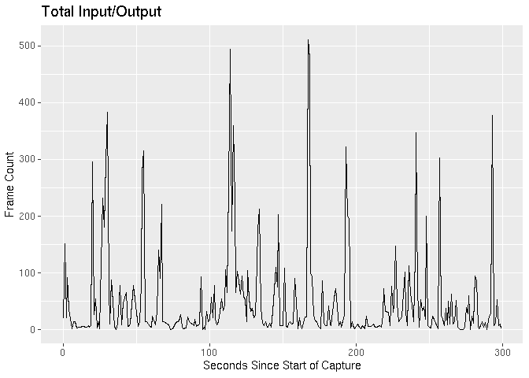
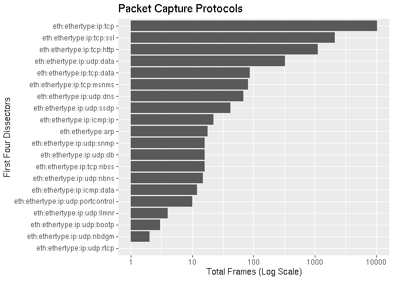
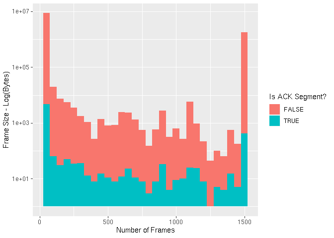
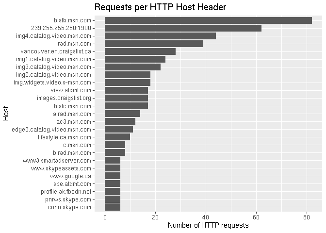
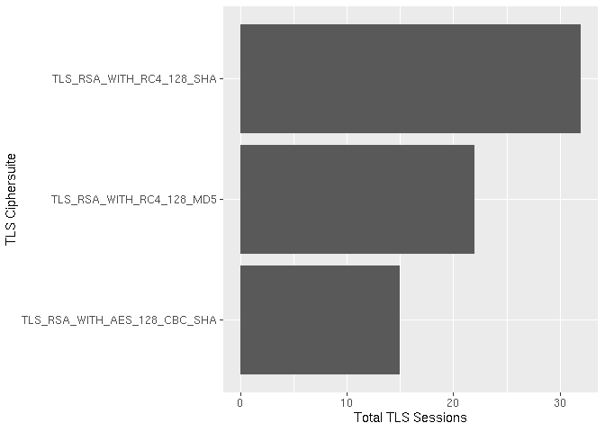
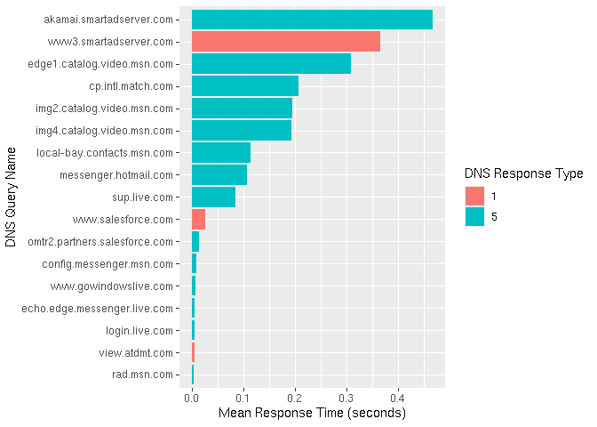

As a network security consultant I’ve spent a my fair share of time
trawling through packet captures, looking for that clue or piece of
evidence I hope will lead me to the root cause of a problem. Wireshark
is the the tool par excellence for interpreting and investigating packet
captures, however I’ve always found that it’s best suited to bottom-up
rather than top-down analysis. Opening a packet capture you’re bombarded
with information, the minutiae from each packet instantly available.
This is perfect if you know what you’re looking for and can filter out
the noise to concentrate on your problem. But if you don’t have a clear
view of what’s in the capture, or where the problem may lie, taking a
step back and removing yourself from the details in Wireshark can be
difficult.

Recently, while reading Hadley Wickham’s [R for Data
Science](https://vita.had.co.nz/papers/tidy-data.pdf) book, the chapter
on [tidy data](https://vita.had.co.nz/papers/tidy-data.pdf) resonated
with me. For the uninitiated, ‘tidy data’ is a method of organising
columnar data to facilitate easier analysis. It can be summarised by
three main properties:

1.  Each variable must have its own column.
2.  Each observation must have its own row.
3.  Each value must have its own cell.

What struck me was that this perfectly described packet captures: each
captured packet being and observation, and the values of the dissectors
the variables. I wondered whether analysis of packet captures could be
done with R and be the top-down compliment to Wireshark’s bottom-up
approach.

In this article I want to show how valuable it can be to perform packet
analysis using the R language. It’s broken into three sections:

-   Conversion of packet captures to columnar data.
-   Creation of Wireshark analogies in R.
-   Deeper dive into the packet captures.

There’s nothing too complicated in here: no regressions, no
categorisation, no machine learning. It’s predominantly about filtering,
counting, summarising and visualising aspects of packet captures. What I
hope you will see is the power and usefulness in these simple actions.

PCAP to CSV Transformation
==========================

The first step is to convert the packet capture file into a format that
R can ingest. I chose the comma separate values format (CSV) for its
simplicity and human readability, however
[SQLLite](https://www.sqlite.org/index.html) and
[Parquet](https://parquet.apache.org/) are other viable options.

We download a sample packet capture file and run a PCAP to CSV
conversion script I’ve written over the top of it:

    packet_capture <- './sample.pcap'
    pcap_to_csv <- './pcap_to_csv'

    # Download the sample packet capture
    if (!file.exists(packet_capture)) {
        download.file(
            url = 'https://tinyurl.com/h545tup',
            destfile = packet_capture
        )
    }

    # Download the PCAP to CSV script to the CWD.
    download.file(
        url = 'https://tinyurl.com/utdbj44',
        destfile = pcap_to_csv
    )

At a high level the script performs the following actions:

-   Spawns a `tshark` process which runs over the packet capture,
    outputting the specified fields in JSON format to STDOUT.
-   Reads the JSON from STDOUT and flattens the data structure.
-   Outputs all of the fields as CSV.

Spawning the tshark process and reading from STDOUT is not the cleanest
of implementations, but it does the job we need it to do.

    time perl pcap_to_csv sample.pcap

    ## Gathering dissectors...
    ## Extracting packets...
    ## Decoding JSON...
    ## Flattening packets...
    ## Creating sample.pcap.csv
    ## perl pcap_to_csv sample.pcap  20.46s user 1.21s system 101% cpu 21.382 total

What’s the size differential?

    ls -lh sample.* | awk '{ print $5, $9 }'

    ## 9.1M sample.pcap
    ## 101M sample.pcap.csv

We see there’s about a 10:1 size ratio between the CSV and the original
packet capture.

This CSV file is then ingested into R and some mutations are performed:

1.  We remove the ‘.0’ from the end of variable names. This allows us to
    refer directly to variables that are only in a frame once, e.g.
    `pcap['tcp.dstport']` instead of `pcap['tcp.dstport.0']`.
2.  The `frame.time` field is changed to a `POSIXct` date-time class
    rather than a simple character string.

<!-- -->

    library(glue)
    library(tidyverse)
    library(kableExtra)

    # Ingest the packet capture
    pcap <- 
        glue(packet_capture, ".csv") %>%
        read_csv(guess_max = 100000)

    # Remove the ':0' from the column names
    names(pcap) <- names(pcap) %>% str_remove('\\.0$')

    # Update the frame.time column
    pcap <-
        pcap %>%
        mutate(frame.time = as.POSIXct(
            frame.time_epoch,
            tz = 'UTC',
            origin = '1970-01-01 00:00.00 UTC'
        ))

Taking a look at some of the key variables in the first 10 rows:

    # First peek
    pcap %>%
        select(
            frame.time,
            ip.src, ip.dst, 
            tcp.dstport, tcp.stream
        ) %>%
        slice(1:5)

    ## # A tibble: 5 x 5
    ##   frame.time          ip.src        ip.dst        tcp.dstport tcp.stream
    ##   <dttm>              <chr>         <chr>               <dbl>      <dbl>
    ## 1 2011-01-25 18:52:22 192.168.3.131 72.14.213.138          80          0
    ## 2 2011-01-25 18:52:22 72.14.213.138 192.168.3.131       57011          0
    ## 3 2011-01-25 18:52:22 192.168.3.131 72.14.213.102          80          1
    ## 4 2011-01-25 18:52:22 192.168.3.131 72.14.213.138          80          0
    ## 5 2011-01-25 18:52:22 72.14.213.102 192.168.3.131       55950          1

Wireshark Analogies
===================

Now that we’ve got our data in to R, let’s explore it. To start with
we’ll emulate some of the native outputs of Wireshark.

I/O Graph
---------

This is the default graph you would find by going to \[Statistics -&gt;
I/O Graph\] in Wireshark. We round the each frame’s time to the nearest
second and tally up the number of frames occurring within each of these
seconds.

    pcap %>%
        group_by(t = round(frame.time_relative)) %>%
        tally() %>%
        ggplot() +
        geom_line(aes(t, n)) +
        labs(
            title = 'Total Input/Output',
            x = 'Seconds Since Start of Capture',
            y = 'Frame Count'
        )

IP Conversations
----------------

This is similar to the output you would get by going to \[Statistics
-&gt; Conversations -&gt; IP\]. We group by source and destination IP
address and count the number of packets and the number of kilobytes in
each of these *unidirectional* IP conversations.

    pcap %>%
        group_by(ip.src, ip.dst) %>%
        summarise(
            packets = n(),
            kbytes = sum(frame.len)/1000
        ) %>%
        arrange(desc(packets)) %>%
        head()

    ## # A tibble: 6 x 4
    ## # Groups:   ip.src [5]
    ##   ip.src        ip.dst        packets kbytes
    ##   <chr>         <chr>           <int>  <dbl>
    ## 1 65.54.95.68   192.168.3.131    1275 1719. 
    ## 2 204.14.234.85 192.168.3.131    1036  957. 
    ## 3 65.54.95.75   192.168.3.131     766  879. 
    ## 4 192.168.3.131 204.14.234.85     740  478. 
    ## 5 192.168.3.131 65.54.95.68       664   66.9
    ## 6 65.54.95.140  192.168.3.131     658  763.

Protocols
---------

In this graph we’re trying to emulate \[Statistics -&gt; Protocol
Hierarchy\]. The `frame.protocols` field lists the dissectors used in
the frame separated by a colon. A regex is used to extract out the first
four dissectors and create a new variable. This variable is grouped
variable and count the number of frames for each one.

We graph the output slightly differently, first flipping the coordinates
to that the x-axis runs top to bottom and y-axis runs left to right,
then scaling the x-axis logarithmically.

No surprises that TCP traffic accounts for the most packets, followed by
SSL (TLS) and HTTP.

    pcap %>%
        mutate(
            first_4_proto = str_extract(frame.protocols, '(\\w+)(:\\w+){0,4}')
        ) %>%
        count(first_4_proto) %>%
        ggplot() +
        geom_col(aes(fct_reorder(first_4_proto, n), n)) +
        coord_flip() +
        scale_y_log10() +
        labs(
            title = 'Packet Capture Protocols',
            x = 'First Four Dissectors',
            y = 'Total Frames (Log Scale)'
        )

Packet Lengths
--------------

This graph is a visual representation of \[Statistics -&gt; Packet
Lengths\]. The axis is broken up into bins of 50 bytes, and the height
of each bar represents the log of the number of packets seen with a size
within that range. The bars are also colourised based on whether the
packet is a TCP acknowledgement or not.

    pcap %>%
        mutate(is_ack = !is.na(tcp.analysis.acks_frame)) %>%
        ggplot() +
        geom_histogram(aes(frame.len, fill = is_ack), binwidth = 50) +
        labs(
            x = 'Number of Frames',
            y = 'Frame Size - Log(Bytes)',
            fill = 'Is ACK Segment?'
        ) +
        scale_y_log10()

Exploratory
===========

We’ve emulated (to an extent) some of the Wireshark statistical
information, let’s dig a little deeper and see what else we can discover
about this particular packet capture.

HTTP Hosts
----------

Let’s explore what HTTP hosts requests are being made to. We filter out
all packets without the `http.host` field, which contains the value of
the [Host
header](https://developer.mozilla.org/en-US/docs/Web/HTTP/Headers/Host),
and count the number of occurrences of each distinct value.

We see an MSN address topping the list, however interestingly a
broadcast address is second.

        pcap %>%
        dplyr::filter(!is.na(http.host)) %>%
        count(http.host) %>%
        top_n(20, n) %>%
        ggplot() +
        geom_col(aes(fct_reorder(http.host, n), n)) +
        coord_flip() +
        labs(
            title = 'Requests per HTTP Host Header',
            x = 'Host',
            y = 'Number of HTTP requests'
        )

Let’s dive a little deeper on this - what are the protocols of these
multicast HTTP packets?

    pcap %>% 
        dplyr::filter(http.host == '239.255.255.250:1900') %>% 
        select(frame.protocols) %>%
        distinct()

    ## # A tibble: 2 x 1
    ##   frame.protocols                  
    ##   <chr>                            
    ## 1 eth:ethertype:ip:udp:ssdp        
    ## 2 eth:ethertype:ip:icmp:ip:udp:ssdp

We see that it’s
[SSDP](https://en.wikipedia.org/wiki/Simple_Service_Discovery_Protocol)
broadcasting out, as well as other hosts responding with ICMP messages.
What are the ICMP messages?

    pcap %>%
        dplyr::filter(
            frame.protocols == 'eth:ethertype:ip:icmp:ip:udp:ssdp'
        ) %>%
        select(icmp.type, icmp.code)

    ## # A tibble: 20 x 2
    ##    icmp.type icmp.code
    ##        <dbl>     <dbl>
    ##  1        11         0
    ##  2        11         0
    ##  3        11         0
    ##  4        11         0
    ##  5        11         0
    ##  6        11         0
    ##  7        11         0
    ##  8        11         0
    ##  9        11         0
    ## 10        11         0
    ## 11        11         0
    ## 12        11         0
    ## 13        11         0
    ## 14        11         0
    ## 15        11         0
    ## 16        11         0
    ## 17        11         0
    ## 18        11         0
    ## 19        11         0
    ## 20        11         0

Type 11 (time exceeded) code 0 (time to live exceeded in transit)
messages.

TLS Versions and Ciphers
------------------------

Taking more of a security perspective, let’s take a look at the SSL/TLS
versions and ciphers being used.

During the TLS handshake, the ClientHello message has two versions: the
record version which indicates which version of the ClientHello is being
sent, and the handshake version which indicates the version of the
protocol the client/server wishes to communicate on during the session.
We’re concerned with the handshake version:

    pcap %>%
        dplyr::filter(!is.na(ssl.handshake.version)) %>%
        count(ssl.handshake.version)

    ## # A tibble: 2 x 2
    ##   ssl.handshake.version     n
    ##   <chr>                 <int>
    ## 1 0x00000300               10
    ## 2 0x00000301              126

The predominant version is TLS 1.1 (0x0301), with some TLS 1.0 (0x0300).

What about the ciphers being used? By filtering out packets that aren’t
part of the handshake and selecting the ciphersuite variable we can get
an idea.

    pcap %>%
        dplyr::filter(!is.na(ssl.handshake.ciphersuite)) %>%
        select(ssl.handshake.ciphersuite)

    ## # A tibble: 122 x 1
    ##    ssl.handshake.ciphersuite
    ##                        <dbl>
    ##  1                     49162
    ##  2                         5
    ##  3                     49162
    ##  4                     49162
    ##  5                     49162
    ##  6                     49162
    ##  7                     49162
    ##  8                     49162
    ##  9                         5
    ## 10                         5
    ## # … with 112 more rows

Unfortunately we don’t get the ciphersuite in a human readable format.
Instead we get the the decimal version of the two-byte identification
number. This makes it’s difficult to make a security judgement on these
ciphers.

Let’s translate these into a human readable format. [This
website](http://realtimelogic.com/ba/doc/en/C/shark/group__SharkSslCiphers.html)
that has a translation table and also - thankfully - has a CSS element
that we can use to pull out the values.

The `rvest` library is used to download the page, pull out the table
entries, and convert them to text. Each entry is a string with the
ciphersuite name and hex separated by spaces, so those are split, and
finally the columns are given sensible names.

    library(rvest)

    s <- 'https://tinyurl.com/t74r83x'

    s %>%
        xml2::read_html() %>%
        html_nodes('.memItemRight') %>%
        html_text() %>%
        str_split_fixed("\\s+", n = 2) %>%
        as_tibble(.name_repair = ~{ c('ciphersuite', 'hex_value') }) %>%
        mutate(hex_value = as.hexmode(hex_value)) ->
        cipher_mappings

    head(cipher_mappings)

    ## # A tibble: 6 x 2
    ##   ciphersuite              hex_value
    ##   <chr>                    <hexmode>
    ## 1 TLS_NULL_WITH_NULL_NULL  0        
    ## 2 TLS_RSA_WITH_NULL_MD5    1        
    ## 3 TLS_RSA_WITH_NULL_SHA    2        
    ## 4 TLS_RSA_WITH_RC4_128_MD5 4        
    ## 5 TLS_RSA_WITH_RC4_128_SHA 5        
    ## 6 TLS_RSA_WITH_DES_CBC_SHA 9

We’re only concerned with the ciphersuite the ServerHello responds with,
because this is the one that is ultimately used. Thus other records are
filtered out, the number of discrete ciphersuites is counted, and the
values converted to hex.

A left join by the hex values is performed which adds the `ciphersuite`
column to the data. The data is presented as a bar graph, the height of
the bar representing the number of times each ciphersuite was used in an
TLS connection.

    pcap %>%
        dplyr::filter(ssl.handshake.type == 2) %>%
        count(ssl.handshake.ciphersuite) %>%
        mutate(
            cs = as.hexmode(ssl.handshake.ciphersuite)
        ) %>%
        left_join(
            cipher_mappings,
            by = c('cs' = 'hex_value')
        ) %>%
        ggplot() +
        geom_col(aes(ciphersuite, n)) +
        coord_flip() +
        labs(x = 'TLS Ciphersuite', y = 'Total TLS Sessions')

DNS Response Times
------------------

Finally, let’s take a look at DNS response times. We filter for DNS
responses, group by the query and the response type, calculate the mean
response time for each of these groups an plot it.

    pcap %>%
        dplyr::filter(dns.flags.response == 1) %>%
        group_by(dns.qry.name, dns.resp.type) %>%
        summarise(mean_resp = mean(dns.time)) %>%
        ggplot() +
        geom_col(aes(
            fct_reorder(dns.qry.name, mean_resp),
            mean_resp,
            fill = as.factor(dns.resp.type)
        )) +
        coord_flip() +
        labs(
            x = 'DNS Query Name',
            y = 'Mean Response Time (seconds)',
            fill = 'DNS Response Type'
        )

What we see that response time for some domains differs. The shorter
response times have a low variance, indicating they likely came from the
resolver’s cache. Other responses have a higher variance, either because
of network latency to authoritative DNS servers, or because other DNS
resolvers in the chain (opaque to us) have the entry cached as well.

Summary
=======

In this article I’ve discussed the conversion of packet capture files to
CSV, and exploratory data analysis of these packet captures. I hope I’ve
shown a how standard packet capture analysis with Wireshark can be
complimented by analysis with the R language.
