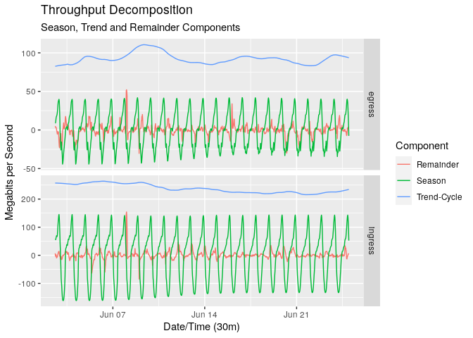
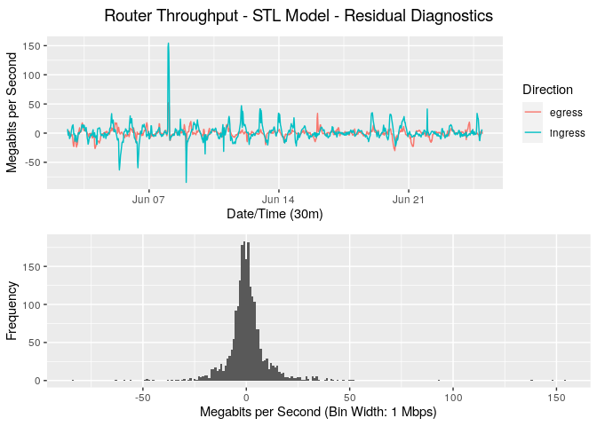
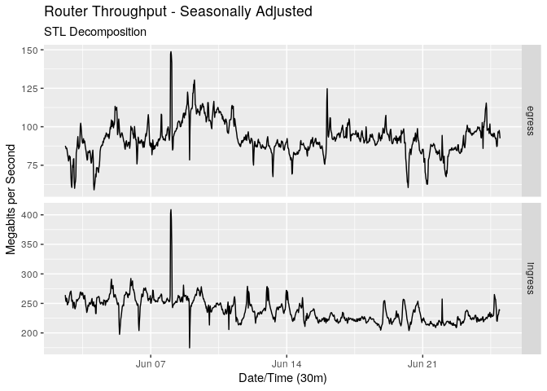
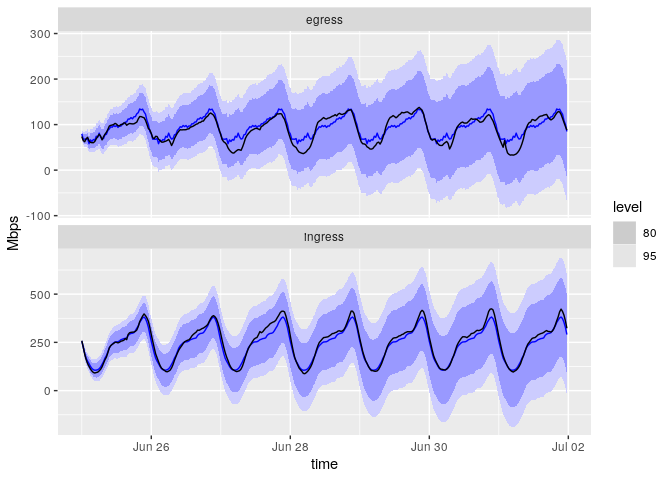

The most satisfying aspect of study I find is when you’re see a links
between two different areas.

I found this when I started studying time series data and forecasting
using the fantastic [Forecasting: Principles and
Practice](https://otexts.com/fpp3/) resources. I immediately saw that
this could be perfect for forecasting network bandwidth utilisation.

In this article we’ll go through using statistical methods to decompose
bandwidth utilisation into different components. We’ll then use these
components to attempts to forecast bandwidth utilisation in the future,
and then determine how accurate our forecasts are.

# Some Notes

First off, I want to stress that this article is only a very small
subset of what could happen in the real world. I’m only going to be
considering a single model here, and I’ll be using rough guesses for
parameters I use within the model. In the real world you’d likely try a
whole lot of different models and parameters within the models, using
bootstrapping or cross-validation to select the best one. This is an
article, not a dissertation, so I’m limiting the scope.

Secondly, I faced a choice of whether to describe the underlying
mathematics followed by practical examples, or vice versa. I’ve decided
to save the maths for the end in the interests of a more interesting
article.

# A Quick Primer

Time series data focuses on a single variable that is observed multiple
times over a period of time. We can contrast this against
cross-sectional data, which focuses on multiple variables observed at
the same point in time.

Some time series data exhibit patterns, and it is therefore possible to
split or ‘decompose’ the these patterns series into components:

-   **Trend**: the long term increase or decrease in the data.
-   **Cycle**: these are rises and falls in the data that are not a
    fixed period.
-   **Seasonal**: a pattern that occurs due to seasonal factors such as
    the time of the day. It’s a fixed and known period.
-   **Remainder**: what’s left after the trend, cycle, and seasonal
    components are removed.

# The Data

    throughput <-
        read_csv(
            'throughput.csv',
            col_types = cols(
                direction = col_character(),
                time = col_character(),
                Mbps = col_number()
            )
        ) %>% 
        mutate(time = ymd_hms(time, tz = 'Australia/Melbourne')) %>% 
        as_tsibble(index = time, key = direction)

    ## Date in ISO8601 format; converting timezone from UTC to "Australia/Melbourne".

Let’s get an understanding of the data and perform some diagnostics on
it. It’s a a time series table or
[tsibble](https://github.com/tidyverts/tsibble) called `throughput`. It
consists of `nrow(throughput)/2` observations of the ingress and egress
bandwidth through a router averaged over a 30 minute interval for
approximately 30 days.

As we’re going to be forecasting, we immediately split out data into a
training set and a test set. The training set will contain the first 23
days of data, and the training set will contain the last 7. We’ll
predominantly use the training set in this article, and only use the
test set to test our forecasts later on:

    throughput_train <- throughput %>% filter_index(. ~ '2021-06-24')
    throughput_test <- throughput %>% filter_index('2021-06-25' ~ '2021-07-01')

We can now take a look at the first week of the training data:

We see a very clear pattern with a daily “seasonal period” for both the
ingress and egress directions. We can use a seasonal plot to get a
better view of the seasonality, which we are pretty confident is one
day. The chart plots each day over the top of each other, giving us a
view of how it varies over time.

This gives us a really good view of the daily ‘seasonality’. For both
ingress and egress traffic we see traffic dropping overnight and
reaching a minimum around 4 am in the morning. It rises slowly at first,
increasing at 9am when everyone starts work. It continues to rise
throughput the day, peaking at around 9pm at night.

# Modelling & Decomposition

We’re going to use ‘Seasonal and Trend decomposition using LOESS’ (STL)
to decompose our time series, where LOESS is locally estimated scatter
point smoothing. We’re going to dive straight into using it in a
practical setting and dive under the hood a little later.

We’re pretty confident that the seasonal period is one day given our
knowledge of the data and the graphs we’ve rendered. But it would be
nice to put a quantative number around that. We can use the `feat_stl()`
function to pull out some STL specific features. As our data is measured
every 30 minutes, a period of 48 is one day.

    throughput_train %>% 
        features(Mbps, list(~{ feat_stl(.x, .period = 48) })) %>% 
        select(
            direction, trend_strength, starts_with('seasonal_strength')
        )

    ## # A tibble: 2 x 3
    ##   direction trend_strength seasonal_strength_48
    ##   <chr>              <dbl>                <dbl>
    ## 1 egress             0.659                0.934
    ## 2 ingress            0.583                0.980

Both the *trend strength* and *seasonal strength* are statistics between
0 and 1, giving a measure of the strength of the components that the STL
decomposition has extracted. We see a reasonable trend, but a very large
seasonal strength, comfirming our inuition of a daily seasonal pattern.
We can now run our model over the data and extract out the components.

    # Define out STL model
    STL_tp <- STL(
        Mbps ~ trend() + season(period = 48),
        robust = TRUE
    )

    # Run an STL model across out data
    tp_stl <-
        throughput_train %>%
        model(STL = STL_tp)

    # Extract out the components
    tp_dcmp_stl <- tp_stl %>% components()

Let’s take a look at each of the components in both the ingress and
egress directions:

Looks reasonable. The trend-cycle looks pretty flat which is to be
expected given the relatively short time frame of the data. The ebbs and
flows of the trend-cycle could be cyclic, or could be some longer term
seasonality that we haven’t captured.

The remainder being small is a good sign, meaning that we’ve hopefully
pulled out most of the ‘signal’ in the trend-cycle and seasonal
components. Let’s focus in on the remainder, also known as the residual.

There still appears to be some seasonality that hasn’t been completely
captured by the model, but that’s not surprising given our simple model.
The residuals have a reasonably Gaussian distribution, albeit with long
tails. This means our prediction intervals should be pretty reasonable.
A *QQ* plot will show us more detail.

For the first two standard deviations each side of the mean our
residuals follow a normal distribution quote well. After that the long
tails become very apparent. What this implies is that our 95%
predication intervals should be good, but we can’t count on anything
above that.

# Forecast

Now that we’ve decomposed out series, we can use this as a way to
forecast our series into the future. This is done by applying a
forecasting

    tp_dcmp_stl %>% 
        ggplot() +
        geom_line(aes(time, season_adjust)) +
        facet_grid(rows = vars(direction), scales = 'free') +
        labs(
            title = 'Router Throughput - Seasonally Adjusted',
            subtitle = 'STL Decomposition',
            x = 'Date/Time (30m)',
            y = 'Megabits per Second'
        )

    # Two decomposition models
    throughput_dcmp_mdl <-
        throughput_train %>%
        model(
            SNAIVE = decomposition_model(
                STL_tp, 
                SNAIVE(season_adjust)
            ),
        )

    throughput_dcmp_fc <-
        throughput_dcmp_mdl %>% 
        forecast(h = '7 days')

    throughput_dcmp_fc %>% 
        autoplot(throughput_test)

    throughput_dcmp_fc %>% 
        accuracy(throughput_test) %>% 
        select(.model, direction, MAE) 

    ## # A tibble: 2 x 3
    ##   .model direction   MAE
    ##   <chr>  <chr>     <dbl>
    ## 1 SNAIVE egress     10.5
    ## 2 SNAIVE ingress    16.0
